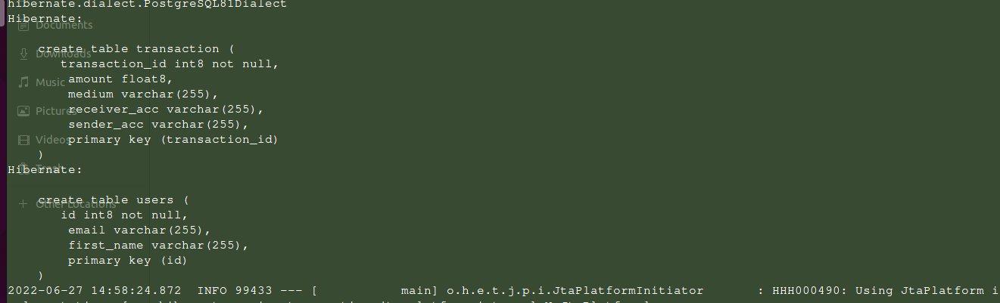
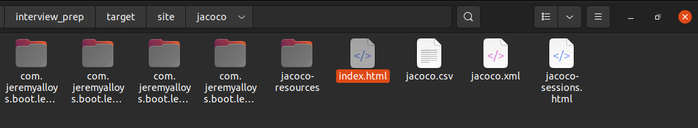
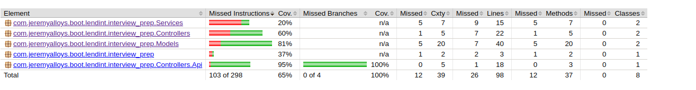
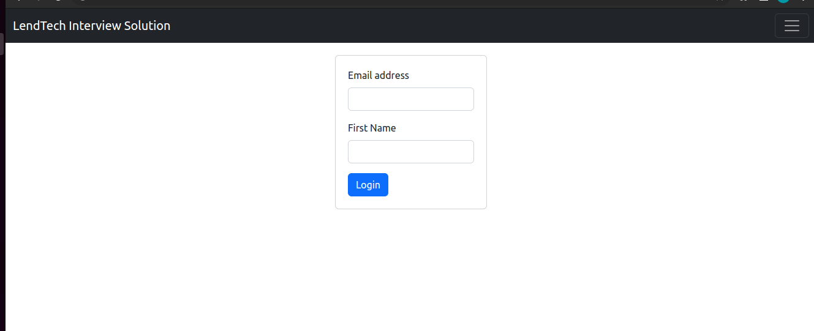
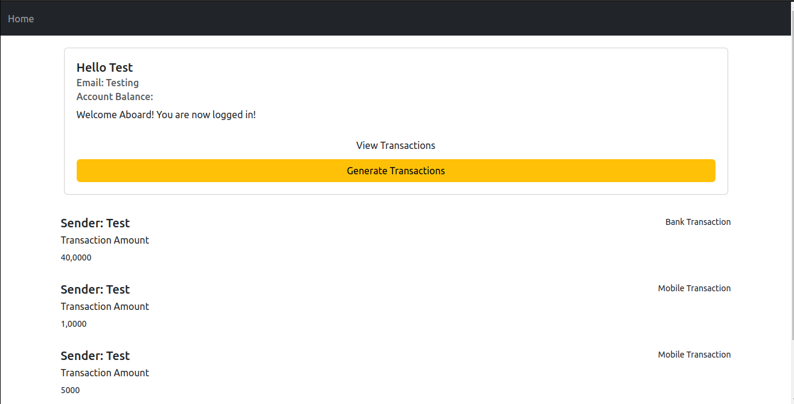

# DENLCHET 
Attempt to impress my way to a nice gig!

## Project PreRequisites
Make sure these are installed on your system:
 - Maven
 - Java
 - Postgresql

## Project setup

In your application.properties, this should be the set up.


```
# This is just to ensure our schema query runs during setup
spring.jpa.hibernate.ddl-auto=none

spring.datasource.url=jdbc:postgresql://localhost:5432/<YourDbName>
spring.datasource.username=<your_postgres_username>
spring.datasource.password=<your password>

spring.jpa.hibernate.ddl-auto=update
spring.jpa.show-sql=true
spring.jpa.properties.hibernate.format_sql=true
spring.jpa.properties.hibernate.dialect=org.hibernate.dialect.PostgreSQL81Dialect

# Name of our app
spring.application.name=Lendapp Interview

# Error redirection
server.error.path=/error2

spring.resources.chain.strategy.content.enabled=true
spring.resources.chain.strategy.content.paths=/**

# Choose a port of your choice
server.port=8084
```

This command will download all packages we need. Make sure db is setup first
It will also run our tests before producing the .JAR image of our app.

```
mvn clean package
```

This is a log of how our DB tables will be created



To see a detailed test report run the following command.

```
mvn test jacoco:report
```

Then navigate to : target/site/jacoco/index.html



This is the actual page in he browser. You can navigate to any file in the project to see which lines are actally tested. I should add more tests.




### Run app

We rerun the first command to compile the app to the .JAR image. The second line should start the app-server.

```
mvn clean package
java -jar target/interview_prep-0.0.1-SNAPSHOT.jar
```

Head over to localhost:8084/ to start the journey

### Home Page


User enters email and first name and these are sent to our DB. See image


Then redirects to the home screen. Make sure you generate transactions as there are none in the DB




## Contributing

I'll be posting issues soon, I just started so they're all over the place